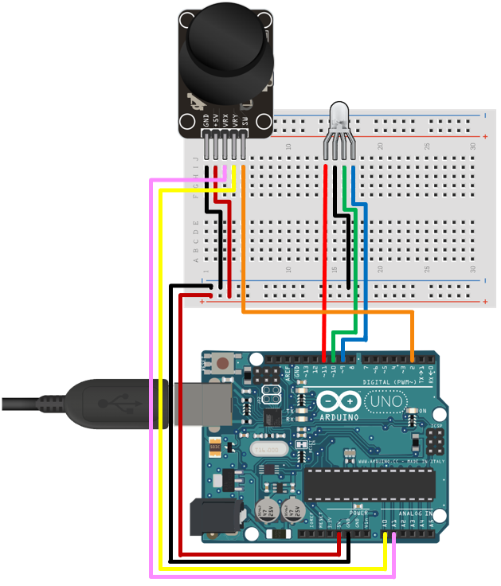

# **Four Treasure Maze Documentation**

 By Jake Mayer

## Overview

**Four Treasure Maze** is a game where the player navigates a randomly generated maze to collect a treasure from each corner of the map within the time limit. 

**USE OF AN ARDUINO IS REQUIRED TO PLAY THE GAME**  

**Game Objective:**   
  
The player must collect each treasure when its color is displayed by the LED connected to the ardiuno. 

**Conditions for Game Over:**  
- The timer reaches zero
- The wrong treasure is collected

**Controls:**  
- Directional input from joystick (left, right, up, down) for movement
- Button on joystick for advancing menus and picking up treasures
  
If the player replays after winning, the game will start to use a larger randomly generated maze.  
  
The game intergates the use of an **Arduino** and the **p5.js** and **Tone.js** libraries.  
  
The randomly generated maze is generated through the use of **Kruskal's Algorithm**.
  
Game design, game sounds, use of the arduino, and how mazes are randomly generated with Kruskal's Algorithm is detailed in later sections of the document.  
  
A gameplay video is included at the bottom of the document. It was filmed in such a way to capture the use of the arduino in the gameplay.

## Game Design

Here is what the game's start screen looks like:  

  
  
The player is able to see: 
- the current timer (starts at 60 seconds)

- the number of treasures collected (starts at 0 treasures)

- the game start message

- the connect button 

The connect button allows the game to link up to the arduino serial port if the Arduino is plugged in via USB.  
Please note that for some browsers this button is not functional. Chrome is the only browser that I am aware of where this is fully functional.  
  
Currently, the game is in the start state. The player is limited to only seeing the start text, a frozen timer, and treasure counter stuck at 0. At this point (assuming the game hasn't been played yet on this page), a random 10x10 maze has already been generated and is just not displayed.  
  
Here is an example of what maze could be when the game starts:  
   
  

Now the player can see: 
- The red, blue, green, and purple treasures in the four corners of the maze

- the player character ( he's yellow :^) )

The game is now in the play state. The player starts in the middle of the maze and the timer begins to tick down. The LED connected to the arduino will light up with either a red, blue, green, or purple color. Now the player can navigate through the maze to reach the treasures. The directions of movement are restricted according to the maze walls. Once the player reaches a treasure, they can pick up the treasure, and then the LED will change color to match of one of the remaining treasures.  
  
Moving the player charcter cycles through sprites to show movement.  
  
Here are the player movement sprites:
  
  

After all four treasures are collected, or the player has a gameover, the end screen will show up. The message on the end screen will change depending on how the game ended.
  
This is what it looks like if the player wins:

    

This is the end state. From here the player can return to the start screen by pressing the joystick button. Returning to the start screen resets everything and generates a new maze (that won't be displayed until the game starts). If the player won like in the screenshot, replaying increases the difficulty level. The harder difficulty uses a random 20x20 maze with a 70 second timer.

A maze from the harder difficulty could look like this:
  
  
  
This difficulty is much harder and will likely take multiple tries to win. Losing does not take the player back to the lower difficulty. Simply refreshing the browser window will do that.

## Game Sounds

Three Synths from `Tone.js` are used in the game

- A regular synth for gameplay noises such as picking up treasures and bumping into walls

- A mono synth for the gameover jingle

- A membrane synth for the game music

A gain setting is applied to all the synths, and each synth has seperate volume values applied. The membrane synth uses a looping tone sequence from `Tone.js` to loop the game music. The mono synth uses a non-looping tone sequence for the gameover jingle. The synth sound for picking up treasures will increase duration for each treasure collected.   
  
Just as a personal note, I found `Tone.js` to be very difficult to use, and advise not using it to those who are not deeply familiar with aspects of sound. `Tone.js` documentation seems to be incomplete.

## Use of Kruskal's Algorithm

Random maze generation was by far the most difficult aspect of this project. It required a fair amount of research to find a feasible way to implement it. There are multiple algorithms that have been used to implement a random maze generator. This implementation uses **Kruskal's Algorithm** which is an algorithm that finds the minimum spanning tree in a undirected weighted graph.   
  
The algorithm has these steps:  
1. Start with a forest of single node trees for each node.

2. Give each node potential branches that go to other nodes and have a weight value

3. Select a random node in the forest

4. From that node, find the branch that has the highest weight and where both nodes are not already in a tree together.

5. Use that branch to combine the trees of the two nodes into one tree.

6. Repeat steps 3 through 5 until the forest only has a single tree left.  

Doing this will create the smallest possible tree that connects all nodes. 

The benefits of using Kruskal's Algorithm:  

- it finds a minimum spanning tree which means that every spot in the maze will have a path to it.

- it generates a completely random tree with this implementation.

- the maze grid will be a collection of paths and there will be no blank areas in the grid.

The drawbacks:
- The algorithm does not try to make complicated paths in the maze which can cause the maze to be less interesting to traverse. 

While more complicated paths are desired, implementing this would be quite difficult as I would have to somehow calculate what a simple path is and prevent it from occuring. Having a path to all spaces in the maze is beneficial since the player needs access the 4 corners in the maze.
  
To use Kruskal's Algorithm in the game's implementation, mazes are treated as grids of square cells with edge lines between adjacent cells in the maze. The maze grid acts initially a forest of single node trees (individual maze cells). A cell's potential branches are the edges between it and adjecent cells. Each edge has equal weight values so they are randomly selected. When cells are joined into a single tree by a branch, the gridlines between them go away. When the algorithm finishes, the result is a maze like the one shown earlier in the **Game Design** section of the document.  
  
Edge lines in each maze are drawn by labeling which edges were joined in maze creation. Edges that were not used to join cells will have a line drawn using `p5.js` and some math. 

## Adruino Details

The arduino uses `final.ino` in the directory `finalproject/final/final.ino`  
  
Here is a diagram that includes all relavent parts to be used with the Arduino:  
  
   
   
Arduino parts:  
- Arduino Board + Breadboard + USB cable
- Joystick
- RGB LED

LED Pins:
- Red is D ~11
- Green is D ~10
- Blue is D ~9  

Joystick Pins:
- VRX is A0
- VRY is A1
- SW is D2

Code for the arduino handles printing the joystick inputs to the serial port, retrieving color values for the RGB LED from the serial port, and displaying the color on the RGB LED.

## Gameplay Video (ctrl + left click to play in new tab)

## Final Thoughts + Future Development

I am pretty satisfied with how the end product turned out, and I do not intend on making any major changes to it. 
  
Here are some changes I would consider adding:  

- Better visuals and sounds (This is an area I lack skill in)

- A way to play the game without an Arduino (not many people own one to play the game)

- A way to set custom maze sizes (right now you can only play in 10x10 and 20x20)  

The project as a whole was a useful experience and I found researching the algorithms for maze creation to be very interesting. I am pretty new to working with java script and Arduino, so I am sure the structure of my code could be done much better. Using an Arduino with this project was fun, but I would avoid using one in the future. The wiring comes apart too easily and certain parts are too delicate. I am curious if it would be possible to hook up a video game controller and use inputs from that. 